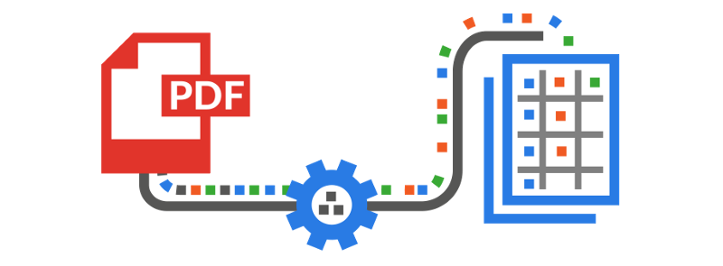

## About html2pdfapi

It runs on localhost:5000/api/converter/ , takes 2 arguments, URL and FILENAME with a get request. 
The URL and FILENAME need to be URL-ENCODED.

- http://www.llamasec.tk

## Understanding the Code
I will try my level best to not fuck up the only piece of document that'll help me in the future but 
it all boils down to how much I wanna kill myself that particular day of document writing. 

## Setting up the development environment
Just run env_setup.py as administrator and magic will happen. If it doesn't work it's because your computer is
a [muggle](https://en.wikipedia.org/wiki/Muggle).

Then run convert.py
 

## Security Vulnerabilities
You better be running this script on localhost, because there is legit no input validation. I'll do that later. Other than that, go nuts.

## License

The license is restricted as shit, except for Ankit beniwal and Sahil Shukla no one is allowed to read this fucking code
you dumb bitches.

Copyright &copy; llamasec 2018 | All rights reserved